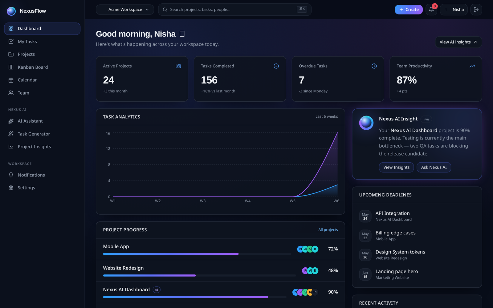
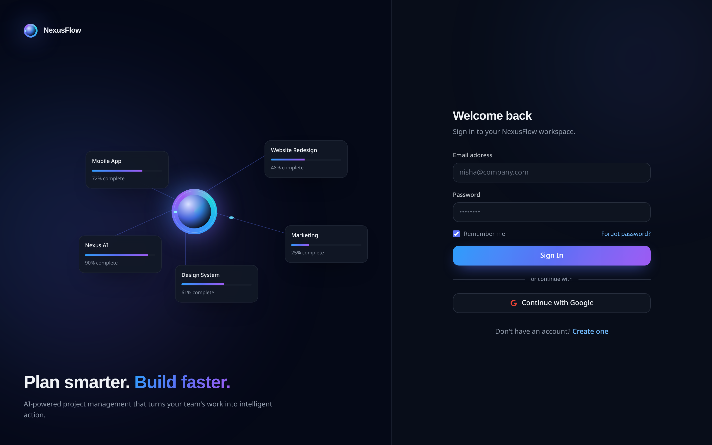
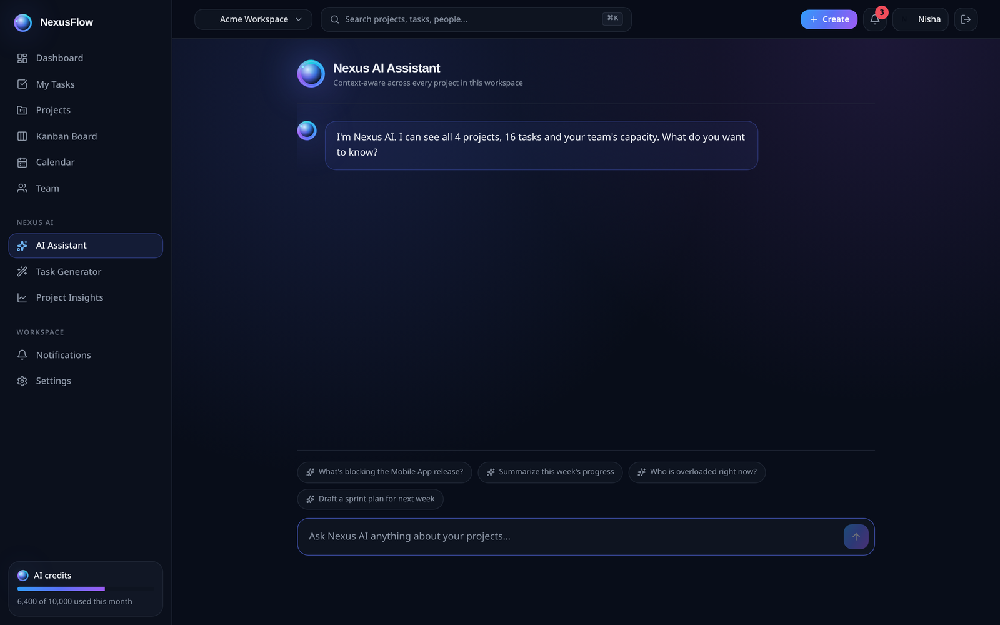

# 🚀 NexusFlow

NexusFlow is a modern, AI-powered project and workspace management SaaS app for product teams.
It brings projects, tasks, boards, calendar, team workload and AI assistance into one premium dark workspace,
backed by a real database and real authentication.

## ✨ Features

- 📊 Dashboard & analytics
- 📋 Task management with filters, subtasks and detail views
- 🗂️ Projects & drag-and-drop Kanban board
- 📅 Calendar with scheduling
- 👥 Team & workspace management with roles
- 🤖 AI Assistant & AI Task Generator
- 🔔 Notifications with per-user read state
- 💬 Comments & activity feed
- 🔐 Real authentication (email/password, Google, password reset)
- 💾 Database-backed persistent data

## 🛠️ Tech Stack

React · TypeScript · TanStack Start / Router · Tailwind CSS · Motion · Recharts
Lovable Cloud (Supabase) · PostgreSQL with Row Level Security · Supabase Auth

## 📸 Screenshots

### Dashboard


### Kanban Board


### AI Assistant


## 🏗️ Project Structure

```text
src/
├── components/
├── lib/
├── routes/
└── styles.css
public/
└── screenshots/
```

## 🔐 Authentication & Data

- NexusFlow uses real authentication — no demo or mock login.
- Email confirmation is required after signup: sign up → confirm email → sign in → enter your workspace.
  Signing up does not sign you in automatically.
- Sessions are persisted and `/app` routes are protected; unauthenticated visitors are redirected to sign in.
- All application data (projects, tasks, comments, notifications, events, activity) lives in PostgreSQL.
- Workspace-level authorization is enforced with Row Level Security, so users only see their own workspace data.
- `localStorage` is not the source of truth for application data — it only holds the auth session and UI preferences.

## 🚀 Getting Started

```bash
npm install
cp .env.example .env   # fill in your own values
npm run dev
```

Environment variables are read from `.env` (see `.env.example` for the required
names). `.env` is git-ignored and must never be committed — only publishable
client keys belong in `VITE_*` variables; server-side secrets are provided as
runtime environment variables.

## ☁️ Deployment

```bash
npm run build   # production build
npm run preview # serve the production build locally
```

Deploy the build output to any Node/edge host, providing the same environment
variables from `.env.example` in the hosting platform's settings.

## 📌 Status

NexusFlow is an actively developed full-stack SaaS project.

